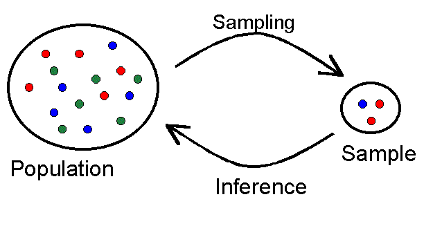

<!-- To allow for two column layout -->
<style>
.forceBreak { -webkit-column-break-after: always; break-after: column; }
</style>

## Why sampling?

* In most cases a complete enumeration is not possible, but if done properly, properties of a population can be inferred from a randomly selected sample



## General approach

* Overall planning of the survey
* Define the population of interest
* Constructing the sampling frame
* Choice of sampling design
* Selection of sample
* Data collection
* Data editing and imputation
* Estimation
* Dissemination


## Sampling error

> - The fact that not all units go into the inference introduces an uncertainty about the estimates which we call **sampling error**
> - The sampling error is a consequence of the fact that we would get (slightly) different results if we could **repeatedly draw** new samples
> - Given a sampling design the sampling error will generally be lower if the units in the population are alike (**low variance**) or the sample size is bigger
> - **Note:** For the same sample size the sampling error will be smaller if a suitable design is chosen


## Simple demonstration of sampling error

```{r}
# synthetic population
set.seed(236542)
N <- 1000
yi <- rnorm(N, mean=5000, s=1000)

# attributes at population level
mean (yi)
```
***

```{r}
hist (yi)
```

***
```{r}
# take a sample of size n
n <- 10
s <- sample(1:length(yi), n, replace = FALSE)

# mean of sample
mean(yi[s])
mean(yi)
```
***
```{r}
# repeat sampling K times
K <- 1000
mu_hat <- numeric(K)

for (i in 1:K){
  s <- sample(1:length(yi), n, replace = FALSE)
  mu_hat[i] <- mean(yi[s])
}

mean(mu_hat)  
```
***
```{r}
# sampling distribution
hist(mu_hat)  
```

***
* Playing with population variance and sample size...
```{r echo=FALSE, fig.height=5, fig.width=8}
set.seed(23478623)
s <- c(1000, 500)
n <- c(10, 20, 40)

N <- 1000   # population size
Y1 <- rnorm(N, mean=5000, s=s[1])
Y2 <- rnorm(N, mean=5000, s=s[2])

K <- 1000

mu_hat1 <- numeric(K)
mu_hat2 <- numeric(K)
mu_hat3 <- numeric(K)
mu_hat4 <- numeric(K)
mu_hat5 <- numeric(K)
mu_hat6 <- numeric(K)

for (i in 1:K){
  s1 <- sample(1:1000, n[1], replace = FALSE)
  s2 <- sample(1:1000, n[2], replace = FALSE)
  s3 <- sample(1:1000, n[3], replace = FALSE)
  mu_hat1[i] <- mean(Y1[s1])
  mu_hat2[i] <- mean(Y1[s2])
  mu_hat3[i] <- mean(Y1[s3])
  mu_hat4[i] <- mean(Y2[s1])
  mu_hat5[i] <- mean(Y2[s2])
  mu_hat6[i] <- mean(Y2[s3])
}

par(mfcol = c(2, 3))
hist(mu_hat1, breaks=seq(3000,6000,100), xlim=c(4000, 6000), ylim=c(0,400), xlab=NULL, ylab=NULL, main="s=1000, n=10")
hist(mu_hat4, breaks=seq(3000,6000,100), xlim=c(4000, 6000), ylim=c(0,400), xlab=NULL, ylab=NULL, main="s=500, n=10")
hist(mu_hat2, breaks=seq(3000,6000,100), xlim=c(4000, 6000), ylim=c(0,400), xlab=NULL, ylab=NULL, main="s=1000, n=20")
hist(mu_hat5, breaks=seq(3000,6000,100), xlim=c(4000, 6000), ylim=c(0,400), xlab=NULL, ylab=NULL, main="s=500, n=20")
hist(mu_hat3, breaks=seq(3000,6000,100), xlim=c(4000, 6000), ylim=c(0,400), xlab=NULL, ylab=NULL, main="s=1000, n=40")
hist(mu_hat6, breaks=seq(3000,6000,100), xlim=c(4000, 6000), ylim=c(0,400), xlab=NULL, ylab=NULL, main="s=500, n=40")
par(mfcol = c(1,1))
```


## Representativity

> - Representativity is **not** dependent upon the sample size
> - For a sample to be representative, **all** units must have the **possibility** to be in the sample (inclusion probability > 0)
    <!-- * Furthermore, the inclusion probabilities $\pi_i$ must be known in order to calculate the actual estimates -->
    <!-- * Also, in some case the **second-order** inclusion probabilities $\pi_{ij}$ must be known to estimate the variance -->
    <!-- * Often both $\pi_i$ and $\pi_{ij}$ follow directly from the design -->
> - The intuitive meaning of a **representative** sample normally is that has a certain size, but also that the marginal properties of the sample resemble those of the population
>     - Certain procedures exist that makes a **balanced sample** in exactly this meaning
>     - A balanced sample is also said to be **well spread** and actual measures for this have been constructed (see eg. Grafström and Tillé)
   

## SRS: Simple random sampling

> - SRS is one of the fundamental building block
> - Assume a population of size $N$ and that a sampling frame (a list of units) is available
> - Randomly select $n$ out of $N$ units without replacement
> - The implied inclusion probability is $\pi = n/N$
> - Note: This is **equivalent** to considering the $C(N,n)$ possible $n$-subsets and randomly select one of these as the sample!


<!-- ## SRS: $s \subset U$ -->

<!-- ```{r echo=FALSE} -->
<!-- library(png) -->
<!-- library(grid) -->
<!-- img <- readPNG("pics/U_and_s.png") -->
<!-- grid.raster(img) -->
<!-- ``` -->

## SRS and the HT-estimator

* Assume a population with $N$ units and that the units have some quantitative attribute $y$
* We seek to estimate the total sum of this attribute over the entire population:
$$ \tau_y = \sum _{j=1}^N y_j$$
* For this purpose we draw a sample of size $n$ by **simple random sampling** (SRS)
* The inclusion probability $\pi$ for each unit is $n/N$

***

* We can now estimate $\tau_y$ by applying the Horvitz-Thomson estimator
* Every single observation from the sample is weighted by the inverse of the inclusion probability:
$$\hat{\tau}_y = \sum_{j=1}^n \frac{N}{n}y_j$$

<!-- * Note:  -->
<!-- > Nogle bryder sig ikke om at opskrive summationen for $\hat{t}_y$ med samme index $j$ som for $t_y$, da det p? en m?de indikerer, at summen l?ber over de f?rste $n$ enheder ud af $N$. I stedet kan man betegne den udvalgte stikpr?ve med $\mathcal{S}$ og skrive -->
<!-- $$ \hat{t}_y = \sum_{j \in \mathcal{S}} \pi^{-1}y_j$$ -->
<!-- Som regel er der dog *ikke* tvivl om hvad der menes, og derfor foretr?kkes notationen med summation over $j = 1, \ldots, n$. -->

***

* The **variance** of $\hat{\tau}_y$ is given by
$$
V(\hat{\tau}_y) = N^2 (1-\frac{n}{N}) \frac{\hat{s}^2}{n}
$$
where $\hat{s}^2$ is an estimate for the variance of $y$ in the population $V(y) = \sigma^2$
* The factor $(1-n/N)$ is the **finite population correction** --- this quantity can be ignored when the sampling fraction $n/N$ is very small
* We normally estimate $s$ from the sample by the **standard deviation**
$$
s = \sqrt{\frac{1}{n-1}\sum_{j=1}^{n}(y_i - \bar{y})^2}
$$


***
* Normally we are more interested in the square root of the variance of the estimate --- this quantity is called the **standard error**
* The standard error is conveniently measured on the same scale as the estimate
* We can also calculate the **coefficient of variation** (or relative standard error)
$$
CV(\hat{\tau}) = \frac{s_\hat{\tau}}{\hat{\tau}}
$$

***

* Note: If instead we wanted to estimate the mean $\mu$ of $y$ in the population then we simply divide by the population size $N$ which yields
$$
\hat{\mu}_y = \frac{1}{N} \hat{\tau}_y = \sum_{i=1}^n \frac{1}{n}y_i
$$
This is simply the **sample mean**
* Consequently the variance for the estimated mean can be found as
$$
V(\hat{\mu}_y) = V(\frac{1}{N}\hat{\tau}_y) = \frac{1}{N^2}V(\hat{\tau}_y) = (1-\frac{n}{N}) \frac{\hat{s}^2}{n}
$$
* Note that $CV(\hat{\tau}) = CV (\hat{\mu}_y)$

## Application of the HT-estimator in R

* Example from Cochran (pp. 27-28)
```{r echo=FALSE}
library(png)
library(grid)
img <- readPNG("pics/cochran_27_p1.png")
grid.raster(img)
```

***
* We start by entering the data, which can be done in any number of ways
```{r}
yi <- c(rep(42,23), rep(41,4), 36, 32, 29, rep(27,2), 23, 19, rep(16,2), 
        rep(15,2), 14, 11, 10, 9, 7, rep(6,3), rep(5,2), 4, 3)
```

* We also need to declare $N$ and $n$: The former is **hard coded** while the latter is derived from the $y_i$'s
```{r}
N <- 676
(n <- length(yi))
```

***
```{r}
hist(yi, breaks=seq(0,42,2))
```


***
* An estimate for the total number of votes is calculated as $\hat{Y} = N\frac{\sum y_i}{n}$:
```{r}
(Yhat <- N * sum(yi) / n)
```

* The 80 pct. confidence limits can be calculated *by hand* as follows
```{r}
Yhat + c(-1,1) * qnorm(0.9) * N * sd(yi) * sqrt(1-n/N) / sqrt(n) 
```


***
* This corresponds to the way the calculations are presented in Cochran...
```{r echo=FALSE}
img <- readPNG("pics/cochran_27_p2.png")
grid.raster(img)
```


***
* An easier approach is to use the **survey** package written by Thomas Lumley (@tslumley) 
```{r message=FALSE, warning=FALSE}
library(survey)
```

* In order to use survey data has to be in a **data frame**
```{r}
sample.data <- data.frame(i=1:n, y=yi, N=N)
head(sample.data, n=5)
```

***
* We now create a **survey object** using the function `svydesign`
* The object is created by describing the **survey design** and point to the **data**
* In our case the function requires a minimal number of argument since the design is very simple
```{r}
srs.design <- svydesign(id=~1,
                        fpc=~N,
                        data=sample.data)
```

***
* There is a summary method for the class of survey objects
```{r}
summary(srs.design)
```

* This is **very** useful with more complicated designs

## {.build}
* You can now estimate the total $\hat{Y}$ in a very simple way -- notice that the **standard error** is automatically reported as well
```{r}
(Yhat <- svytotal(~y, srs.design))
```

* The requested **confidence limits** can be derived using the standard error, but it is more convenient to use the function made specifically for this purpose
```{r}
confint(Yhat, level=0.80)
```


